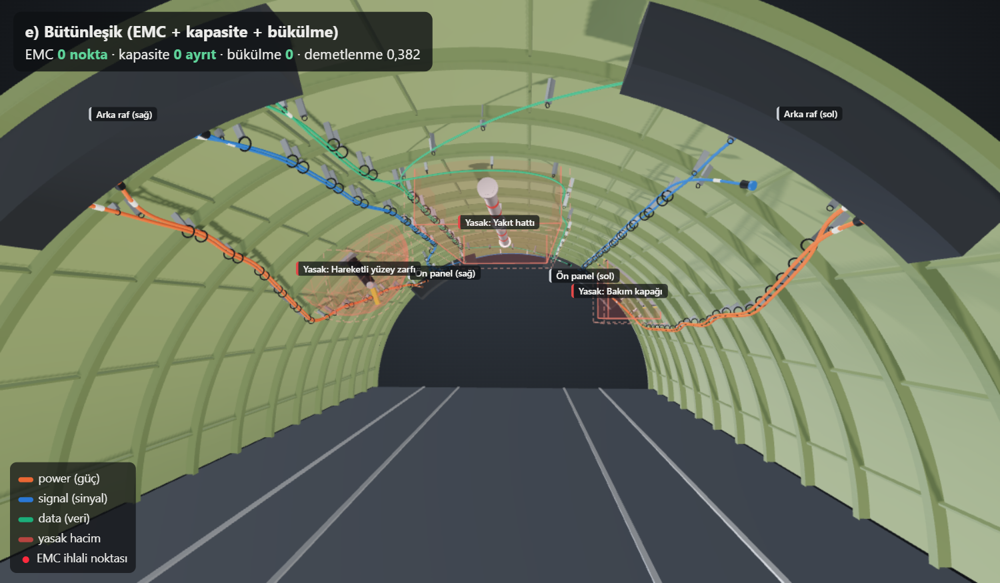
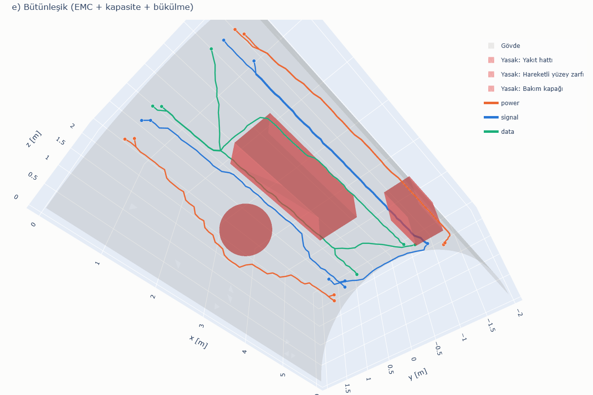

# Wire Harness Routing Demo — EMC-aware automatic routing on a 3D fuselage surface

[Türkçe](README.md) | **English**

[](https://github.com/Goktugelbir/Emc-duyarli-kablo-rotalama/actions/workflows/ci.yml)

**An integrated router that bundles cables while respecting EMC separation, edge capacity, the minimum
bend radius and a clearance around keep-out volumes reduces the 5660 EMC violation points, 116 capacity
violations and 15 bend violations created by bundling in this scenario to zero, while keeping the
bundling ratio at 0.382.**


*Looking up into the arch from below the fuselage. Left, bundling: the red dots are the EMC violations found by
the independent check. Right, integrated routing: every check is 0.*


*Integrated method (e): cables are laid one by one in the order the method routed them; clamps appear at the end.*

## Interactive 3D view

A page where you can switch between the 3D views of the five methods with tabs:
**[goktugelbir.github.io/Emc-duyarli-kablo-rotalama](https://goktugelbir.github.io/Emc-duyarli-kablo-rotalama/)**
(local copy: [`docs/index.html`](docs/index.html)).



The page is rendered with three.js using physically based materials, environment lighting and shadows:

- fuselage skin with a primer-painted interior and a translucent aluminium exterior; frames, stringers and a floor (seat tracks, floor beams),
- tube-shaped cables whose thickness depends on the class; cables sharing a route are laid side by side inside the bundle,
- clamps and standoff brackets along the bundles, connectors, ID sleeves and equipment racks at the terminals,
- hardware inside the keep-out volumes (a fuel pipe with red bands, a swinging actuator arm, a riveted access
  panel) and their boundaries grown by the clearance (dashed red lines),
- **Play routing:** cables are laid one by one in the order in which the method last routed them (rip-up and
  reroute included); violation points and clamps appear at the end,
- hovering a cable shows its name, class and route length; clicking it shows a translucent envelope as wide as
  the largest separation required to the other classes,
- seven check results per method (EMC, bend, keep-out, clearance, capacity violations and the lengths),
- camera presets (inside, below, outside, top), toggleable layers and an automatically widened field of view
  on narrow screens.

These realism elements are visual only; cable routes, violation points and metrics come directly from the routing
and the independent checks. The page opens on the integrated method (e). Its labels are in Turkish.

To enable Pages: in the repository go to **Settings → Pages → Build and deployment → Source: "Deploy from a branch"**,
select branch `main`, folder `/docs`, and save.

## Introduction

This repository is a small, simplified prototype for the problem of **EMC-aware automatic
routing of aircraft wire harnesses on three-dimensional fuselage geometry**. The goal is not to
solve the real problem; it is to show that we understand the problem correctly and that we can
build a testable, modular software skeleton. Every result is therefore measured with checks that
are independent of the routing code, and the code is protected by automated tests and continuous
integration (CI).

## Problem

A fuselage section is given as a triangulated surface model (mesh). Each cable has a start
point, an end point and an EMC class (power / signal / data). The task is to produce surface
routes for all cables such that:

- cables are **bundled** as much as possible (shared routes → fewer supports/clamps, less weight),
- the **separation distance** between cables of different EMC classes is maintained,
- **keep-out volumes** (fuel line, moving-surface envelope, maintenance access panel, etc.) are not entered
  and not approached closer than a **clearance**,
- the **minimum bend radius** and the **maximum number of cables (capacity)** that may pass through a route segment are not exceeded.

These objectives conflict: bundling gathers cables together while EMC wants to keep them apart;
capacity limits how thick a bundle may get, and the bend radius forbids sharp turns.
In the real project the problem will be modelled as a capacitated Steiner forest and solved with
Lagrangian relaxation; this demo addresses a small, simplified version of the same problem with
five methods.

## Scope

**What the demo does**

- Generates a representative fuselage section shaped as a half cylinder with radius 2 m and
  length 6 m as a triangle mesh with ~0.10 m spacing (3904 vertices, 7560 triangles; a small,
  fixed-seed jitter is applied to interior vertices).
- Defines three keep-out volumes (two boxes, one sphere), grows them by a 0.05 m clearance, and removes
  the 429 nodes inside them, as well as the edges crossing the grown volumes, from the graph
  (remaining graph: 3475 nodes, 10033 edges).
- Builds a synthetic scenario of 11 cables (5 + 4 cables run in parallel on the two sides,
  2 cables cross from one side to the other). Neighbouring terminals are of different classes
  and close to each other, but the distance between them is larger than the required separation.
- Runs five routing methods and checks the results with five checks that are independent of the routing code.
- Measures how sensitive the sequential methods are to cable order and terminal positions with a
  40-trial **robustness benchmark**.
- Writes the metrics as a table and produces a 3D PNG per method, a comparison image, a rotating GIF,
  a metrics chart, a Lagrangian convergence plot, the interactive 3D page and a run log.

**What the demo does not do**

- There is no clamp spacing constraint (the clamps in the interactive page are visual only).
- No real aircraft data, real CAD geometry or real cable list is used.
- There is no shielding assignment; EMC is represented only by geometric separation distance.
- The Lagrangian formulation is **simplified** (see below); there is no Steiner forest
  structure, cable cross-sections, bundle diameter or weight model.
- The bend radius is part of the routing only in the integrated method (e); the other methods only check it afterwards.
- Cables run on the surface (along mesh vertices); there are no supports standing off the surface.
- The clearance is conservative for boxes: the grown box contains every point closer than 0.05 m to the box
  and excludes slightly more around the corners.

### Representative parameters

All of the values below are **representative**; none are taken from any standard or from a real aircraft.

| Parameter | Value |
|:---|---:|
| Separation power–signal | 0.15 m |
| Separation power–data | 0.20 m |
| Separation signal–data | 0.10 m |
| Same class | 0 m |
| Minimum bend radius | 0.10 m |
| Keep-out clearance | 0.05 m |
| Edge capacity K | 2 cables (deliberately tight so the constraint is active) |
| Bundling discount factor | cost of an already used edge × 0.4 |
| EMC penalty | edge length × 20 (additional cost); × 2 in every reroute round |
| Capacity penalty (method e) | edge length × 1000 on a full edge (additional cost) |
| Rip-up-and-reroute rounds | c: at most 5, e: at most 10 |
| Randomness | mesh jitter `seed = 42`, robustness benchmark `seed = 7` |

## Installation and running

Python 3.11+ is required. Dependency versions are **pinned** in [`requirements.txt`](requirements.txt):
how shortest-path ties are broken can change between library versions, which changes e.g. the
Lagrangian iteration count. The published outputs were generated with exactly these versions.

```bash
pip install -r requirements.txt
```

```bash
python main.py
```

This command regenerates all outputs: the metrics and robustness tables under `outputs/`, the 3D images
(`routes_*.png`, `comparison.png`, `viewer_inside.png`, `demo.gif`), the 2D charts (`metrics_chart.png`,
`lagrangian_convergence.png`), `run_log.txt` and `docs/index.html`. On our machine the total time is ~65 s:
~37 s robustness benchmark, ~22 s capturing the 3D images, ~4 s 2D charts and ~2 s for mesh, routing and checks.

Image export uses a Chrome/Chromium installed on the system (if there is none, it can be downloaded with the
`plotly_get_chrome` command). Since the 3D images are captured from the interactive page and the page loads
three.js from a CDN, this step needs an **internet connection**; viewing `docs/index.html` needs one as well.

### Command-line options

| Option | Default | Description |
|:---|:---|:---|
| `--no-images` | off | skips PNG/GIF export, no Chrome needed; metrics, robustness table, log and interactive page are still written |
| `--trials N` | 20 | trials per robustness family; `0` skips the benchmark |
| `--out DIR` | `outputs/` | output folder |
| `--docs DIR` | `docs/` | folder of the interactive page |
| `--capacity K` | 2 | edge capacity |
| `--clearance M` | 0.05 | keep-out clearance [m] |
| `--order STR` | `input` | cable priority ordering strategy (`input`, `critical-first`, `longest-first`, `shortest-first`) |

For example, to produce only the metrics and the page in a few seconds:

```bash
python main.py --no-images --trials 0
```

The whole console output is also written to `outputs/run_log.txt` (without local folder paths).

### Tests and continuous integration

```bash
pip install -r requirements-dev.txt
```

```bash
pytest
```

There are 35 tests under [`tests/`](tests) (~7 s):

- **Checks** (`test_checks.py`): circumradius, resampling, EMC, bend, capacity, keep-out and clearance
  counts on small examples that can be worked out by hand.
- **Geometry and graph** (`test_geometry_graph.py`): the grown volume contains the clearance
  neighbourhood, routable nodes respect the clearance, no edge enters a volume, connectivity, symmetry.
- **Routing** (`test_routing.py`): every path is valid (correct terminals, real edges); the baseline
  finds the same lengths as networkx; the turn graph contains no U-turns and no sharp turns; method (e)
  passes every check; rip-up and reroute keeps EMC violations at zero for random orders; the Lagrangian
  lower bound never decreases and never exceeds the upper bound; without a feasible solution the
  Lagrangian fails cleanly instead of producing NaN.
- **Robustness benchmark** (`test_benchmark.py`): the terminal perturbation never brings terminals of
  different classes closer than their separation; structure of the summary table.
- **Regression** (`test_regression.py`): the published metrics table (below) is reproduced exactly.
- **End to end** (`test_cli.py`): `main.py --no-images` writes every file, exports no PNG, the log has no
  local paths, the JSON is valid and the data embedded in the page is consistent.

`pytest.ini` turns `RuntimeWarning` into errors, so NaN/infinite steps cannot slip through unnoticed.
The GitHub Actions workflow ([`.github/workflows/ci.yml`](.github/workflows/ci.yml)) runs the tests and a
`python main.py --no-images --trials 3` smoke run with Python 3.11 on every push and pull request and keeps
the outputs as an artifact.

### Technical notes on the images

- **All 3D images in this README are captured from the interactive page itself** (`harness_demo/capture.py`).
  The page is opened in headless Chrome in its capture mode (`docs/index.html?capture`): only the 3D view is
  shown and the page exposes a `window.viewer` interface to select a method, place the camera and set the
  routing progress. Chrome is driven over the DevTools protocol with `choreographer`, the library kaleido uses
  as well. What you see in the README is therefore exactly what the interactive page shows.
- The numbers in the image captions come from the metrics embedded in the page. The red dots are the EMC
  violation points found by `checks.py` themselves (drawn twice as large in capture mode so they stay visible);
  for every method the code verifies with an `assert` that their number equals the value in the table.
- Pillow is used only to place the finished screenshots side by side and to assemble the GIF frames; no
  pixel-level editing is done. In the GIF the camera is fixed and all frames share one palette (the EMC class
  colours are guaranteed to be in it), so the file only stores the regions that change and stays small (~200 KB).
- The metrics chart and the Lagrangian convergence plot are drawn with plotly (`harness_demo/visualize.py`).

## Project structure

```
harness_demo/
  geometry.py    # parametric half-cylinder mesh + keep-out volumes (box, sphere), growing by a clearance
  graph.py       # mesh -> routing graph (networkx), keep-out node/edge removal, CSR export
  scenarios.py   # synthetic 11-cable scenario, EMC separation table, terminal perturbation
  routing.py     # 5 methods: baseline, bundling, EMC-aware, Lagrangian, integrated; turn graph
  checks.py      # independent checks (do not use the routing code)
  metrics.py     # metrics and table formatting
  benchmark.py   # robustness benchmark: random cable order and terminal perturbation
  visualize.py   # 2D charts (plotly): metrics chart, Lagrangian convergence
  presentation.py# interactive page: embeds the results as JSON into the viewer template
  viewer_template.html # three.js-based interactive 3D viewer template (capture mode included)
  capture.py     # captures the README 3D images from the page with headless Chrome (PNG + GIF)
  export.py      # wirelist (CSV) and 3D route coordinates (JSON) exports
main.py          # end-to-end run, command-line options
tests/           # pytest tests (35 tests)
outputs/         # 3D images (PNG, GIF), 2D charts, wirelist.csv, routes.json, metrics.md, robustness.md, lagrangian_history.json, run_log.txt
docs/index.html  # single-page interactive 3D view for GitHub Pages
.github/workflows/ci.yml   # tests + smoke run
requirements.txt / requirements-dev.txt   # pinned versions
```

## Methods

**a) Baseline.** Independent Dijkstra for each cable on the graph with edge weight = Euclidean length.

**b) Bundling.** Cables are routed in scenario order; the cost of every edge used by another
cable is reduced by a factor of 0.4. Later cables thus join existing routes.

**c) EMC-aware bundling.** In addition to (b), the nodes within `separation distance + 0.03 m`
of a cable's route are marked as "risky" for the other EMC classes. This neighbourhood is computed
only around the route with `scipy.spatial.cKDTree.query_ball_point`. A cable of a different class
pays an extra penalty on edges touching a risky node. The penalty is soft: it can be violated if
necessary, but it is expensive.

Sequential routing depends on the cable order: a cable only "sees" the cables routed before it.
The first pass is therefore followed by **rip-up and reroute**. Using its own conflict measure (sample
points closer than the separation and, if applicable, edges over capacity), the router finds the
conflicting cables. It rips them up and reroutes them one by one, most conflicting first, now seeing
**all** other cables, with the EMC penalty doubled in every round. It stops when no conflict is left
or the round limit is reached. The best solution seen is returned, so rerouting can never make the
result worse. (The router's conflict measure only decides what to reroute; the reported metrics come
from the independent checks.)

**d) Simplified Lagrangian relaxation.** The model solved is:

```
min  Σ_k length(P_k)               (P_k: path of cable k)
s.t. load_e = |{k : e ∈ P_k}| ≤ K   for every edge e
```

The capacity constraint is moved into the objective with multipliers λ_e ≥ 0:

```
L(λ) = Σ_k SP_k(w + λ) − K · Σ_e λ_e
```

The problem thus decomposes into an independent shortest-path subproblem per cable, and L(λ)
is a **lower bound** on the optimum for every λ. λ is updated by projected subgradient
(`g_e = load_e − K`) with a Polyak step size. In every iteration, a repair heuristic that routes
sequentially with `w + λ` costs while closing edges whose capacity is full produces a feasible
solution, i.e. an **upper bound**. The lower and upper bounds are recorded at every iteration.

The Polyak step targets the best upper bound. While no feasible solution has been found (the upper
bound is infinite), the target is the best lower bound raised by 5 %, so the step is always finite.
(In the previous version the step became infinite in that case and the multipliers turned into NaN; a
test now guards this case.) Unknown bounds are written as `null` to `lagrangian_history.json`.

> This is a **simplified** version of the formulation in the real project: here the objective
> is only the total cable length, and bundling (paying for a shared edge once) is not in the
> model. In the real project the objective will include the capacitated Steiner forest
> structure, EMC constraints and node selection costs.

**e) Integrated method (EMC + capacity + bend).** The bundling, EMC penalty and rip-up-and-reroute
logic of (c) run on a bend-aware **turn graph**:

- **The bend radius is a hard constraint.** Each state of the turn graph is a directed edge (u→v); a
  transition (u→v)→(v→w) exists only if w ≠ u and the radius of the circle through u, v, w is not smaller
  than the minimum bend radius. This is exactly the condition the independent bend check tests, so every
  path found has zero bend violations by construction. In this scenario 53 % of the 109,924 possible turns
  (such as 90° turns) are removed and 51,544 remain. The cost of a state is paid when its edge is entered.
  A virtual source connects to every edge leaving the start node and every edge reaching the end node
  connects to a virtual sink, so there is no turn constraint at the terminals (connector).
- **Capacity** is practically hard: a full edge (already carrying K other cables) costs 1000 times its
  length extra. If the geometry leaves no other choice, routing does not fail; the violation is reported.
- **EMC and bundling** are as in (c). Rip-up and reroute also takes capacity conflicts into account and
  runs for at most 10 rounds.

## Independent checks

`checks.py` does not use the routing module or the graph; it takes only the node lists and
vertex coordinates and recomputes everything from geometry:

- **EMC violation:** Routes are resampled at 0.05 m spacing. A sample point closer than the
  required separation to a route of a different class counts as a violation (once per
  offending route). Unit: points.
- **Bend:** Violation if the radius of the circle through three consecutive vertices is smaller
  than 0.10 m (an approximate criterion).
- **Keep-out volume:** Violation if one of the sample points at 0.05 m spacing lies inside a box/sphere.
- **Clearance:** Violation if a sample point is outside a volume but closer than 0.05 m to it. The
  distance is computed exactly from the volume's raw parameters (Euclidean distance to the box, distance
  to the sphere surface). To show that the check actually works, `main.py` also routes the baseline on a
  graph built **without** the clearance: that produces 69 clearance violation points.
- **Capacity:** Number of edges carrying more than K cables.

## Results

Output of `python main.py` (same as `outputs/metrics.md`):

| Method | Total length [m] | Unique length [m] | Bundling ratio | EMC violation [points] | Bend violation | Keep-out violation | Clearance violation [points] | Capacity violation [edges] | Time [s] |
|:---|---:|---:|---:|---:|---:|---:|---:|---:|---:|
| a) Baseline (independent Dijkstra) | 61.66 | 51.65 | 0.162 | 980 | 0 | 0 | 0 | 20 | 0.00 |
| b) Bundling | 71.84 | 17.80 | 0.752 | 5660 | 15 | 0 | 0 | 116 | 0.01 |
| c) EMC-aware bundling | 66.18 | 35.22 | 0.468 | 0 | 8 | 0 | 0 | 35 | 0.12 |
| d) Lagrangian relaxation (K=2) | 61.76 | 53.80 | 0.129 | 887 | 0 | 0 | 0 | 0 | 0.91 |
| e) Integrated (EMC + capacity + bend) | 66.05 | 40.80 | 0.382 | 0 | 0 | 0 | 0 | 0 | 0.09 |


Lagrangian: 60 iterations (iteration limit); lower bound 61.7624 m, upper bound 61.7639 m, gap 0.0014 m (0.002 %).
Bundling ratio = 1 − unique length / total length. Times are routing time only (excluding
checks and plotting) and vary by machine.

### Discussion

- **Baseline** gives the shortest total length but bundles the cables hardly at all (0.162).
  Even so there are 980 EMC violation points: the shortest paths leaving neighbouring terminals
  approach each other at the edges of the keep-out volumes. A "shortest path only" approach
  without EMC awareness is therefore not sufficient.
- **Bundling** reduces the unique route length from 51.7 m to 17.8 m (ratio 0.752). The price is
  a ~17 % increase in total cable length and a large increase in EMC violations (5660 points),
  because cables of different classes share the same edges. Capacity violations (116 edges) and bend
  violations (15) are also the highest.
- **EMC-aware bundling** reduces EMC violations to zero in this scenario while keeping the
  bundling ratio at 0.468: cables are bundled within a class, and separate routes form between
  classes. It does not, however, respect capacity (35 edges) or the bend radius (8).
- The **Lagrangian** method removes the baseline's 20 capacity violations with only 0.11 m (0.17 %)
  of extra length. The gap between the lower and upper bound is 0.0014 m (0.002 %), i.e. the solution
  found is at most 1.4 mm from the optimum of this simplified model on this graph. Since the model has
  no EMC or bundling, EMC violations are at the baseline level.
- The **integrated method** is the only method that satisfies all five checks at once: EMC, bend,
  keep-out, clearance and capacity violations are all 0. Its total length (66.05 m) is even slightly
  shorter than that of (c). Its bundling ratio (0.382) is lower than that of (c), because K = 2 allows at
  most two cables per edge; this is the natural price of the deliberately tight capacity.
- No method produced a keep-out or clearance violation; since the nodes inside the grown volumes and the
  edges crossing them are removed from the graph, this is the expected result and has been confirmed by
  the independent checks.

### Robustness benchmark: does the result depend on the cable order?

With sequential methods a single "0 violations" result can be luck. `benchmark.py` measures this with
two families of trials (20 trials each, `seed = 7`). **Random order:** the original scenario with the
cables routed in a random order. **Terminal perturbation:** in addition, every terminal is shifted by up
to ±0.05 m axially and ±1.5° around the arc. These bounds are small enough never to bring terminals of
different classes closer than their separation (a test checks this). Every trial is measured with the
independent checks (`outputs/robustness.md`; the table is generated with Turkish labels — "Rastgele sıra"
= random order, "uç nokta sapması" = terminal perturbation, "tek geçiş" = single pass, "söküp yeniden
rotalama" = rip-up and reroute):

| Family | Method | EMC violations = 0 | EMC mean / max [points] | Capacity mean / max [edges] | Bend max | All checks clean |
|:---|:---|---:|---:|---:|---:|---:|
| Random order | c) single pass | 6/20 | 24.1 / 72 | 59.1 / 116 | 13 | 0/20 |
| Random order | c) + rip-up and reroute | 20/20 | 0.0 / 0 | 70.7 / 116 | 18 | 0/20 |
| Random order | e) Integrated | 16/20 | 1.6 / 10 | 0.0 / 0 | 0 | 16/20 |
| Random order + terminal perturbation | c) single pass | 7/20 | 15.8 / 55 | 57.5 / 108 | 10 | 0/20 |
| Random order + terminal perturbation | c) + rip-up and reroute | 20/20 | 0.0 / 0 | 52.4 / 110 | 16 | 0/20 |
| Random order + terminal perturbation | e) Integrated | 20/20 | 0.0 / 0 | 0.0 / 0 | 0 | 20/20 |

- Without rip-up and reroute, (c) is EMC-clean in only 13 of 40 trials, so the "0 violations" result in
  the original scenario was partly a matter of order. With rip-up and reroute it is EMC-clean in all 40.
- (c) does not respect capacity or bend radius in any order, so it never passes all checks.
- (e) passes all five checks in 36 of 40 trials. Bend radius and capacity are satisfied in every trial.
  In the remaining 4 trials (all with the original terminals in a random order) at most 10 EMC violation
  points remain: the tight capacity, the bend constraint and EMC separation conflict for some orders.
  Since the penalty is soft, zero violations are not guaranteed.

## All methods

| a) Baseline | b) Bundling |
|:---:|:---:|
|  |  |
| **c) EMC-aware bundling** | **d) Lagrangian relaxation** |
|  |  |
| **e) Integrated** | |
|  | |


All images are captured from the interactive page with the same camera, looking up into the fuselage from
below ([`docs/index.html`](docs/index.html), all five methods on one page). In the images the bundle axis is
lifted ~10 cm off the surface, cables sharing a route are laid side by side inside the bundle and corners are
smoothed; this is visual only and does not enter the checks or metrics. Frames, stringers, clamps, connectors
and equipment racks are visual as well.

> Note: the images, tables and the interactive page are generated with Turkish labels.

## How to extend this in the real project

- **Capacitated Steiner forest:** Each edge is "opened" once (channel/support cost) and the
  cables passing over it are limited by capacity. This represents bundling directly in the
  objective instead of as a heuristic discount. With Lagrangian relaxation the subproblems still
  decompose into shortest-path / Steiner tree problems, which can be solved on the bend-aware turn graph.
- **EMC inside the Lagrangian framework:** The EMC penalty of the integrated method can be relaxed with
  separate multipliers for the separation constraints, turning a heuristic penalty into a model that
  produces lower bounds.
- **Node selection cost:** Node costs for branch points, pass-through holes and connection
  points; control over the number of bundle split/merge points.
- **Shielding as an active routing variable:** The shielded/unshielded choice enters the model
  as a decision variable that changes the separation requirement and has a cost/weight.
- **Clamp spacing:** Support points must be placeable along the route at allowed intervals;
  proximity to suitable structural attachment points.
- **Cable order:** The robustness benchmark measures the order sensitivity of sequential methods. In the
  real project, ordering heuristics or fully simultaneous (Lagrangian-based) methods can reduce it.
- **Real geometry and export to CAD:** Importing real mesh/CAD data and exporting the resulting
  routes back to the CAD environment (e.g. STEP/line geometry).

---

AI-assisted tools were used during development; design decisions and verification are our team's.
