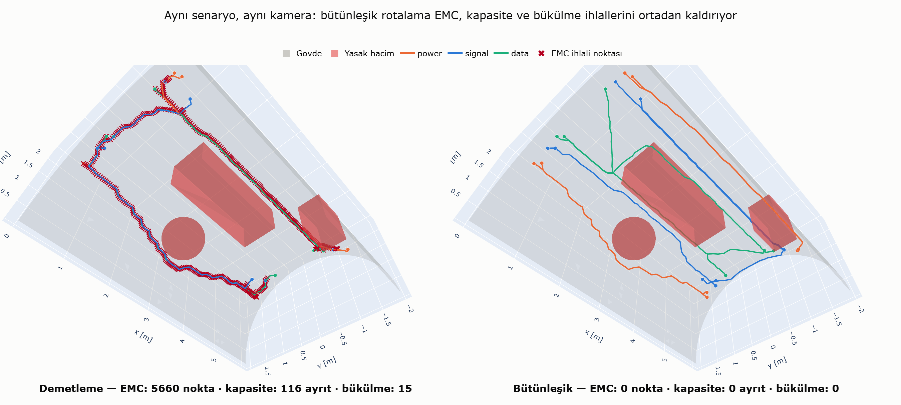
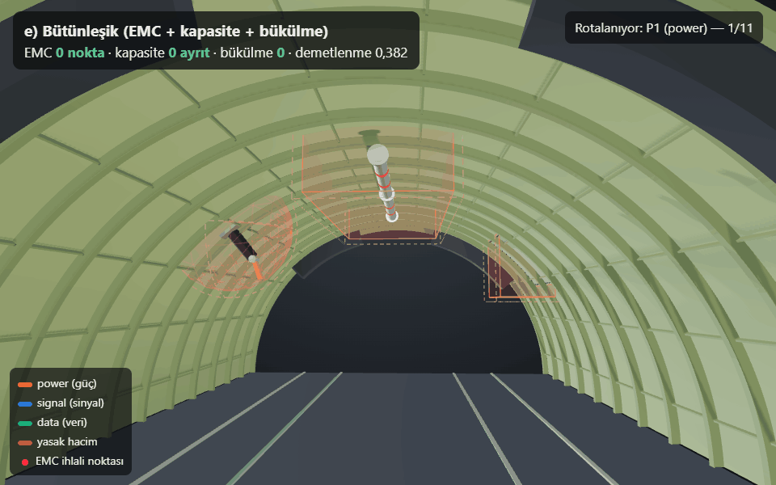
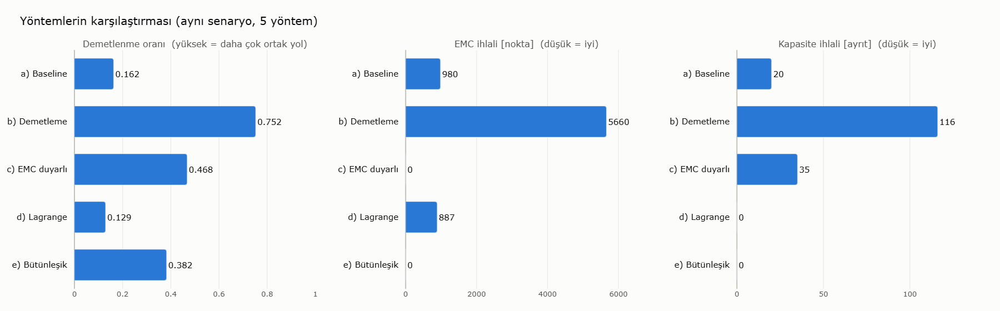
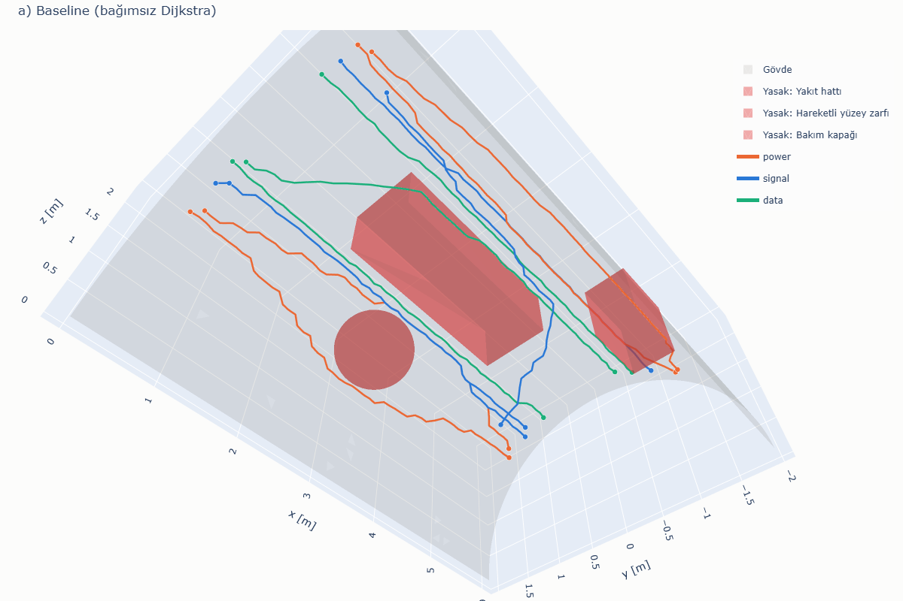
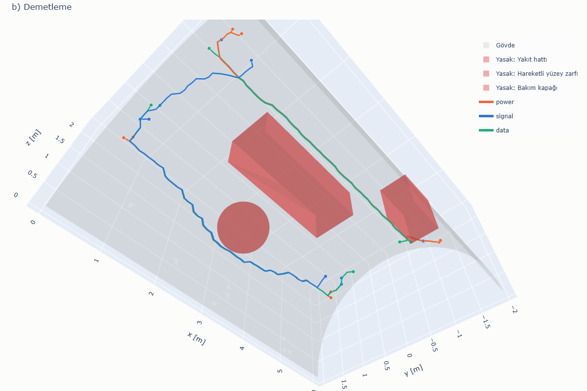
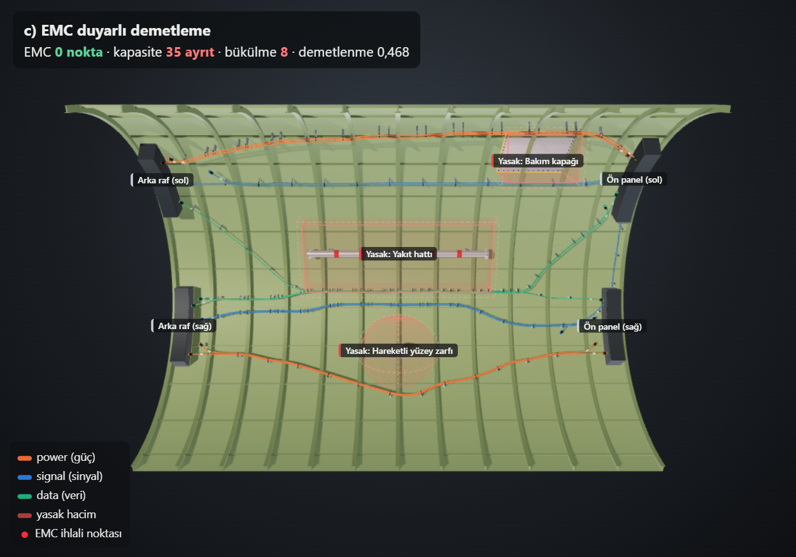
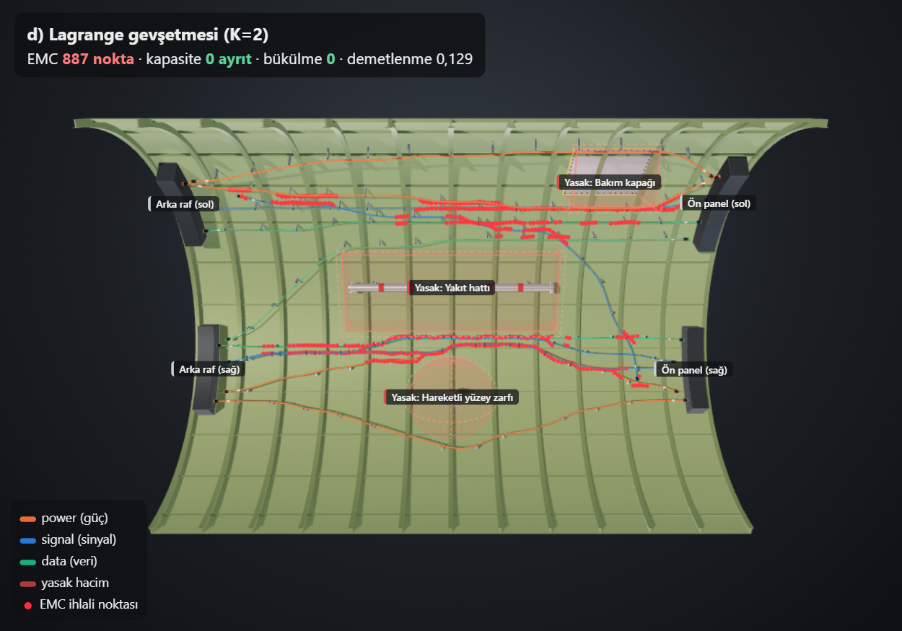
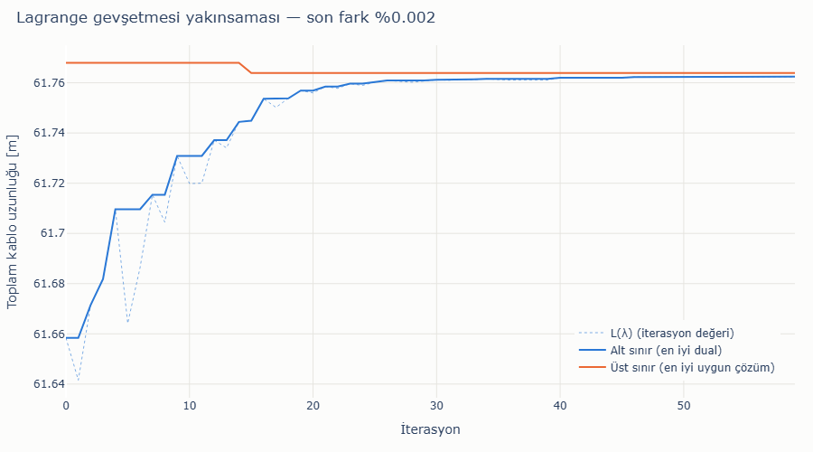

# Kablo Demeti Rotalama Demosu — 3B gövde yüzeyinde EMC duyarlı otomatik rotalama

**Kabloları demetlerken EMC ayrım mesafesini de maliyete katan rotalama, bu senaryoda
demetlemenin yarattığı 5572 EMC ihlal noktasını sıfıra indirirken demetlenme oranını 0,486'da tutuyor.**





## Etkileşimli 3B görünüm

Dört yöntemin 3B görünümü arasında sekmelerle geçilebilen sayfa: **[goktugelbir.github.io/Emc-duyarli-kablo-rotalama](https://goktugelbir.github.io/Emc-duyarli-kablo-rotalama/)**
(yerel kopya: [`docs/index.html`](docs/index.html)).

Pages'i açmak için: depo **Settings → Pages → Build and deployment → Source: "Deploy from a branch"**,
dal `main`, klasör `/docs` seçip kaydedin.

## Giriş

Bu depo, **uçak kablo demetlerinin üç boyutlu gövde geometrisi üzerinde EMC duyarlı otomatik
rotalanması** problemi için hazırlanmış küçük, basitleştirilmiş bir prototiptir. Amaç asıl
problemi çözmek değil; problemi doğru anladığımızı ve test edilebilir, modüler bir yazılım
iskeleti kurabildiğimizi göstermektir.

## Problem

Bir gövde kesiti üçgen yüzey modeli (mesh) olarak verilir. Her kablonun bir başlangıç ve bir
bitiş noktası ile bir EMC sınıfı (güç / sinyal / veri) vardır. İstenen, tüm kablolar için
yüzey üzerinde güzergâh üretmektir; öyle ki:

- kablolar mümkün olduğunca **demetlensin** (ortak güzergâh → daha az destek/kelepçe, daha az ağırlık),
- farklı EMC sınıfındaki kablolar arasında **ayrım mesafesi** korunsun,
- **yasak hacimlere** (yakıt hattı, hareketli yüzey zarfı, bakım kapağı vb.) girilmesin,
- **minimum bükülme yarıçapı** ve bir güzergâh parçasından geçebilecek **en fazla kablo sayısı (kapasite)** aşılmasın.

Bu hedefler birbiriyle çelişir: demetleme kabloları bir araya toplar, EMC ise ayırmak ister.
Asıl projede problem kapasiteli Steiner ormanı olarak modellenip Lagrange gevşetmesiyle
çözülecektir; bu demo aynı problemin küçük ve basitleştirilmiş bir halini dört yöntemle ele alır.

## Kapsam

**Demo ne yapıyor**

- Yarıçapı 2 m, uzunluğu 6 m olan yarım silindir şeklinde temsilî bir gövde kesitini
  ~0,10 m aralıklı üçgen mesh olarak üretir (3904 köşe, 7560 üçgen; iç köşelere sabit seed'li
  küçük bir düzensizlik eklenir).
- Üç yasak hacim tanımlar (iki kutu, bir küre), içlerinde kalan 361 düğümü ve bu hacimleri
  kesen ayrıtları çizgeden çıkarır (kalan çizge: 3543 düğüm, 10224 ayrıt).
- 11 kablodan oluşan sentetik bir senaryo kurar (5 + 4 kablo iki yan tarafta paralel akar,
  2 kablo bir yandan diğerine geçer). Komşu uç noktalar farklı sınıftandır ve birbirine yakındır,
  ancak aralarındaki mesafe gereken ayrım mesafesinden büyüktür.
- Dört rotalama yöntemini çalıştırır, sonuçları rotalama kodundan bağımsız denetimlerle kontrol
  eder, metrikleri tablo olarak yazar, her yöntem için 3B PNG, tek sayfalık etkileşimli 3B görünüm ve Lagrange yöntemi için
  yakınsama grafiği üretir.

**Demo ne yapmıyor**

- Kelepçe aralığı kısıtı yoktur.
- Gerçek uçak verisi, gerçek CAD geometrisi veya gerçek kablo listesi kullanılmamıştır.
- Ekranlama (shielding) ataması yoktur; EMC yalnızca geometrik ayrım mesafesiyle temsil edilir.
- Lagrange formülasyonu **basitleştirilmiştir** (aşağıya bakınız); Steiner ormanı yapısı,
  kablo kesitleri, demet çapı ve ağırlık modeli yoktur.
- Bükülme yarıçapı rotalama sırasında optimize edilmez, yalnızca sonradan denetlenir.
- Kablolar yüzey üzerinde (mesh köşeleri boyunca) ilerler; yüzeyden uzaklaşan destekler yoktur.

### Temsilî parametreler

Aşağıdaki değerlerin tamamı **temsilîdir**; herhangi bir standarttan veya gerçek bir uçaktan alınmamıştır.

| Parametre | Değer |
|:---|---:|
| Ayrım mesafesi power–signal | 0,15 m |
| Ayrım mesafesi power–data | 0,20 m |
| Ayrım mesafesi signal–data | 0,10 m |
| Aynı sınıf | 0 m |
| Minimum bükülme yarıçapı | 0,10 m |
| Ayrıt kapasitesi K | 2 kablo (kısıtın etkin olması için bilerek dar seçildi) |
| Demetleme indirim katsayısı | kullanılmış ayrıtın maliyeti × 0,4 |
| EMC cezası | ayrıt uzunluğu × 20 (ek maliyet) |
| Rastgelelik | `seed = 42` (yalnızca mesh düzensizliği için) |

## Kurulum ve çalıştırma

Python 3.11+ gerekir.

```bash
pip install -r requirements.txt && python main.py
```

Bu tek komut tüm çıktıları yeniden üretir: `outputs/` altındaki metrik tablosu, PNG
görünümleri, `comparison.png`, `metrics_chart.png`, `demo.gif` ve `docs/index.html`. Bizim
makinemizde toplam süre ~38 s'dir; bunun büyük kısmı görüntü dışa aktarımıdır (içe aktarma,
mesh, rotalama ve denetimler birlikte ~3 s). PNG üretimi için `kaleido` 1.x sistemde kurulu
bir Chrome/Chromium kullanır; yoksa `plotly_get_chrome` komutuyla indirilebilir. `docs/index.html`
plotly.js'i CDN'den yükler (görüntülemek için internet gerekir).

Görüntülerle ilgili teknik notlar:

- Tüm 3B görünümler plotly ile çizilir. Başsız (headless) WebGL'de bir figürde birden fazla
  3B sahne güvenilir çizilmediği için `comparison.png`'nin iki paneli ve `demo.gif`'in her
  karesi ayrı figürler olarak dışa aktarılır. Pillow yalnızca bu hazır PNG'leri yan yana
  yerleştirmek ve GIF karelerini birleştirmek için kullanılır; piksel düzeyinde düzenleme yapılmaz.
- `comparison.png` üzerindeki kırmızı ✕ işaretleri, `checks.py`'nin bulduğu EMC ihlal
  noktalarının kendisidir. Panel başlıklarındaki sayılar metrik tablosundan alınır; kod, işaret
  sayısının tablodaki değerle aynı olduğunu `assert` ile doğrular.

## Proje yapısı

```
harness_demo/
  geometry.py    # parametrik yarım silindir mesh'i + yasak hacimler (kutu, küre)
  graph.py       # mesh -> rotalama çizgesi (networkx), yasak düğüm/ayrıt temizliği, CSR çıktısı
  scenarios.py   # 11 kablolu sentetik senaryo, EMC ayrım tablosu
  routing.py     # 4 yöntem: baseline, demetleme, EMC duyarlı, Lagrange
  checks.py      # bağımsız denetimler (rotalama kodunu kullanmaz)
  metrics.py     # metrikler ve tablo biçimlendirme
  visualize.py   # plotly 3B görselleştirme ve yakınsama grafiği
  presentation.py# karşılaştırma görseli, döner GIF, metrik grafiği, etkileşimli sayfa
main.py          # uçtan uca çalıştırma
outputs/         # PNG, GIF, metrics.md, lagrangian_history.json, run_log.txt
docs/index.html  # GitHub Pages için tek sayfalık etkileşimli 3B görünüm
```

## Yöntemler

**a) Baseline.** Her kablo için ayrıt ağırlığı = Öklid uzunluğu olan çizgede bağımsız Dijkstra.

**b) Demetleme.** Kablolar senaryo sırasıyla rotalanır; önceki bir kablonun kullandığı her
ayrıtın maliyeti 0,4 katsayısıyla düşürülür. Böylece sonraki kablolar mevcut güzergâhlara katılır.

**c) EMC duyarlı demetleme.** (b)'ye ek olarak, bir kablo rotalandıktan sonra güzergâhına
`ayrım mesafesi + 0,03 m` mesafedeki düğümler, diğer EMC sınıfları için "riskli" işaretlenir.
Bu komşuluk `scipy.spatial.cKDTree.query_ball_point` ile yalnızca güzergâhın çevresinde
hesaplanır. Sonraki farklı sınıftan bir kablo, riskli düğüme dokunan ayrıtlarda ek ceza öder.
Ceza yumuşaktır: gerekirse ihlal edilebilir, ama pahalıdır.

**d) Basitleştirilmiş Lagrange gevşetmesi.** Çözülen model şudur:

```
min  Σ_k uzunluk(P_k)              (P_k: k. kablonun yolu)
s.t. yük_e = |{k : e ∈ P_k}| ≤ K   her ayrıt e için
```

Kapasite kısıtı λ_e ≥ 0 çarpanlarıyla amaç fonksiyonuna taşınır:

```
L(λ) = Σ_k SP_k(w + λ) − K · Σ_e λ_e
```

Böylece problem her kablo için bağımsız bir en kısa yol alt problemine ayrışır ve L(λ) her
λ için optimumun **alt sınırıdır**. λ, Polyak adım boyuyla izdüşümlü subgradient
(`g_e = yük_e − K`) ile güncellenir. Her iterasyonda, kapasitesi dolan ayrıtları kapatarak
`w + λ` maliyetleriyle sıralı rotalayan bir onarım sezgiseli uygun bir çözüm, yani **üst sınır**
üretir. Alt ve üst sınır her iterasyonda kaydedilir.

> Bu, asıl projedeki formülasyonun **basitleştirilmiş** halidir: burada amaç yalnızca
> toplam kablo uzunluğudur ve demetleme (paylaşılan ayrıtın bir kez ödenmesi) modelde yoktur.
> Asıl projede amaç kapasiteli Steiner ormanı yapısını, EMC kısıtlarını ve düğüm seçim
> maliyetlerini içerecektir.

## Bağımsız denetimler

`checks.py` rotalama modülünü veya çizgeyi kullanmaz; yalnızca düğüm listelerini ve köşe
koordinatlarını alıp her şeyi geometriden yeniden hesaplar:

- **EMC ihlali:** Güzergâhlar 0,05 m aralıkla yeniden örneklenir. Bir örnek nokta, farklı
  sınıftan bir güzergâha gereken ayrım mesafesinden yakınsa ihlal sayılır (her ihlal eden
  güzergâh için bir kez). Birim: nokta.
- **Bükülme:** Ardışık üç köşeden geçen çemberin yarıçapı 0,10 m'den küçükse ihlal (yaklaşık bir ölçüt).
- **Yasak hacim:** 0,05 m aralıklı örnek noktalardan biri bir kutu/küre içindeyse ihlal.
- **Kapasite:** K'dan fazla kablo taşıyan ayrıt sayısı.

## Sonuçlar

`python main.py` çıktısı (`outputs/metrics.md` ile aynı):

| Yöntem | Toplam uzunluk [m] | Benzersiz uzunluk [m] | Demetlenme oranı | EMC ihlali [nokta] | Bükülme ihlali | Yasak hacim ihlali | Kapasite ihlali [ayrıt] | Süre [s] |
|:---|---:|---:|---:|---:|---:|---:|---:|---:|
| a) Baseline (bağımsız Dijkstra) | 61.23 | 52.32 | 0.145 | 952 | 0 | 0 | 17 | 0.00 |
| b) Demetleme | 71.36 | 17.72 | 0.752 | 5572 | 15 | 0 | 116 | 0.01 |
| c) EMC duyarlı demetleme | 67.17 | 34.56 | 0.486 | 0 | 10 | 0 | 50 | 0.04 |
| d) Lagrange gevşetmesi (K=2) | 61.27 | 52.50 | 0.143 | 962 | 0 | 0 | 0 | 0.96 |



Lagrange: 56 iterasyon; alt sınır 61,27 m, üst sınır 61,27 m (fark < 10⁻⁶ m).
Demetlenme oranı = 1 − benzersiz uzunluk / toplam uzunluk. Süreler yalnızca rotalama
süresidir (denetim ve çizim hariç); makineye göre değişir.

### Yorum

- **Baseline** en kısa toplam uzunluğu verir ama kabloları neredeyse hiç demetlemez (0,145).
  Buna rağmen 952 EMC ihlal noktası vardır: komşu uç noktalardan çıkan en kısa yollar yasak
  hacimlerin kenarında birbirine yaklaşır. EMC farkındalığı olmayan "sadece en kısa yol"
  yaklaşımı bu yüzden yeterli değildir.
- **Demetleme** benzersiz güzergâh uzunluğunu 52,3 m'den 17,7 m'ye indirir (oran 0,752);
  bunun bedeli toplam kablo uzunluğunda ~%16 artış ve EMC ihlallerinde büyük bir artıştır
  (5572 nokta), çünkü farklı sınıftan kablolar aynı ayrıtları paylaşır. Kapasite ihlali de en
  yüksektir (116 ayrıt).
- **EMC duyarlı demetleme** bu senaryoda EMC ihlalini sıfıra indirirken demetlenme oranını
  0,486'da tutar: kablolar sınıf içinde demetlenir, sınıflar arasında ayrı güzergâhlar oluşur.
  Toplam uzunluk demetlemeden kısa, baseline'dan uzundur. Ceza yumuşak olduğundan sıfır ihlal
  garanti değildir; burada uç noktalar uygun aralıkta seçildiği için mümkün olmuştur.
- **Bükülme:** (b) ve (c)'deki 10–15 ihlal, maliyetlerin güzergâhları ani dönüşlere
  zorlamasından kaynaklanır; bükülme maliyet fonksiyonunda olmadığı için bu beklenen bir
  sonuçtur ve asıl projede rotalamaya dahil edilmesi gereken bir kısıttır.
- **Lagrange** yöntemi baseline'ın 17 kapasite ihlalini yalnızca 0,04 m (%0,07) ek uzunlukla
  ortadan kaldırır. Alt ve üst sınır çakıştığı için bulunan çözüm, bu basitleştirilmiş model ve
  bu çizge için (sayısal tolerans içinde) optimaldir. Bu modelde EMC ve demetleme olmadığından
  EMC ihlalleri baseline düzeyindedir; asıl projede bu terimlerin aynı çerçeveye eklenmesi gerekir.
- Hiçbir yöntem yasak hacim ihlali üretmemiştir; çizgeden hem yasak düğümler hem de hacmi kesen
  ayrıtlar çıkarıldığı için bu beklenen sonuçtur ve bağımsız denetimle doğrulanmıştır.

## Tüm yöntemler

| a) Baseline | b) Demetleme |
|:---:|:---:|
|  |  |
| **c) EMC duyarlı demetleme** | **d) Lagrange gevşetmesi** |
|  |  |



Etkileşimli sürüm: [`docs/index.html`](docs/index.html) (dört yöntem tek sayfada). 3B görsellerde kabloların gövde yüzeyiyle çakışmaması ve üst üste binen
kabloların ayırt edilebilmesi için her kablo yüzeyden içeri doğru 2–6 cm kaydırılarak
çizilmiştir; bu kaydırma yalnızca görseldir, denetimlere ve metriklere girmez.

## Asıl projede nasıl genişletilir

- **Kapasiteli Steiner ormanı:** Her ayrıt bir kez "açılır" (kanal/destek maliyeti) ve
  üzerinden geçen kablolar kapasiteyle sınırlanır. Bu, demetlemeyi sezgisel indirim yerine
  doğrudan amaç fonksiyonunda temsil eder; Lagrange gevşetmesi ile alt problemler yine en kısa
  yol / Steiner ağacı problemlerine ayrışır.
- **Düğüm seçim maliyeti:** Dallanma noktaları, geçiş delikleri ve bağlantı noktaları için
  düğüm maliyetleri; demet ayrılma/birleşme noktalarının sayısının kontrolü.
- **Ekranlama aktif bir rotalama değişkeni olarak:** Ekranlı/ekransız seçim, ayrım mesafesi
  gereksinimini değiştiren ve maliyeti/ağırlığı olan bir karar değişkeni olarak modele girer.
- **Kelepçe aralığı:** Güzergâh boyunca destek noktalarının izin verilen aralıkta
  yerleştirilebilmesi; uygun yapısal bağlantı noktalarına yakınlık.
- **Bükülme yarıçapının rotalamaya katılması:** Yön bilgisi içeren genişletilmiş çizge veya
  güzergâh sonrası düzleştirme.
- **Gerçek geometri ve CAD'e aktarım:** Gerçek mesh/CAD verisinin içe alınması, sonuç
  güzergâhların CAD ortamına (ör. STEP/çizgi geometrisi) geri aktarılması.

## English summary

This repository is a small, simplified prototype for **EMC-aware automatic routing of
aircraft wire harnesses on a 3D fuselage mesh**. A half-cylinder section (R = 2 m, L = 6 m)
is triangulated, three keep-out volumes are removed from the routing graph, and 11 synthetic
cables (power / signal / data) are routed with four methods: independent Dijkstra, sequential
bundling with an edge-reuse discount, EMC-aware bundling with a KD-tree-limited proximity
penalty, and a simplified Lagrangian relaxation of per-edge capacity (subgradient updates,
lower/upper bounds tracked). Independent checks recompute EMC separation, bend radius,
keep-out and capacity violations. In this scenario, bundling raises the bundling ratio from
0.145 to 0.752 but multiplies EMC violations; the EMC-aware variant removes all EMC violations
while keeping a ratio of 0.486; the Lagrangian method removes all capacity violations at
+0.07 % length with a closed bound gap. All parameters are representative; no real aircraft
data is used, and clamp spacing and shielding assignment are not modelled.

---

Geliştirmede yapay zekâ destekli araçlar kullanılmıştır; tasarım kararları ve doğrulama ekibimize aittir.
